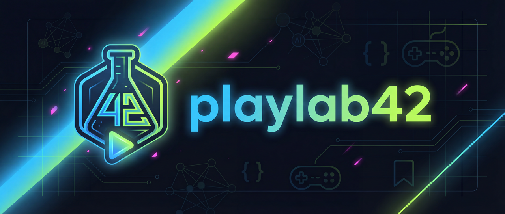

# Playlab42

Plateforme pédagogique complète pour la formation au développement assisté par IA : supports de cours, base de connaissance, outils et jeux collaboratifs.

**[Voir la démo live](https://docaposteinno.github.io/playlab42/)**

## Vision

**Playlab42** est à la fois un **support de formation**, un **démonstrateur technique** et un **projet collaboratif vivant**.

### 📚 Consulter - Base de connaissance

Le site met à disposition des **ressources pédagogiques** sélectionnées par les formateurs :
- **Parcours thématiques** : Slides et contenus structurés (histoire de l'IA, transformers, agents, etc.)
- **Documentation** : Guides pratiques, howto, tutoriels
- **Concepts clés** : Explications accessibles de notions techniques
- **Bookmarks** : Liens vers des ressources externes de qualité

### 🔍 Apprendre par l'exemple - Le projet comme démonstrateur

Playlab42 n'est pas qu'un catalogue : **son code source illustre les bonnes pratiques** du développement moderne assisté par IA :
- **Prompts pré-configurés** : Instructions pour agents IA (AGENTS.md, CLAUDE.md)
- **OpenSpec** : Workflow de spécification et gestion des changements
- **Agents spécialisés** : Commandes slash pour différents contextes
- **CI/CD** : Intégration continue avec GitHub Actions
- **Qualité** : Linting, tests automatisés, couverture de code
- **Conteneurisation** : Environnement Docker reproductible

### 🚀 Contribuer - Enrichir le projet

Chaque session de formation se conclut par une **contribution réelle** via Pull Request. Les participants peuvent :
- **Créer un mini-jeu** : Morpion, snake, quiz, etc.
- **Développer un outil** : Convertisseur JSON, palette de couleurs, encodeur...
- **Rédiger une documentation** : Présenter un concept, un hobby, un sujet technique
- **Améliorer l'existant** : Corriger des bugs, enrichir les contenus

## Documentation

Consultez le [README complet](../README.md) pour :
- Architecture détaillée et concepts
- Guide de contribution
- Installation et développement
- Structure du projet

---

*Projet collaboratif - Docaposte*
