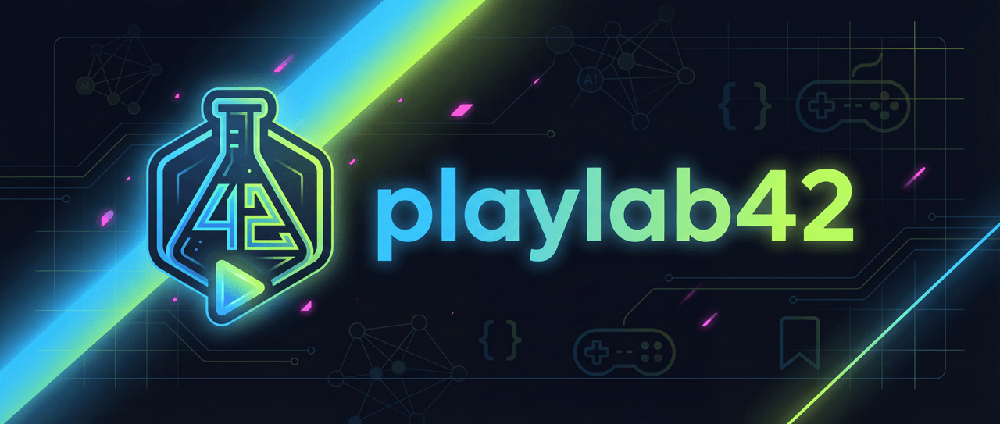
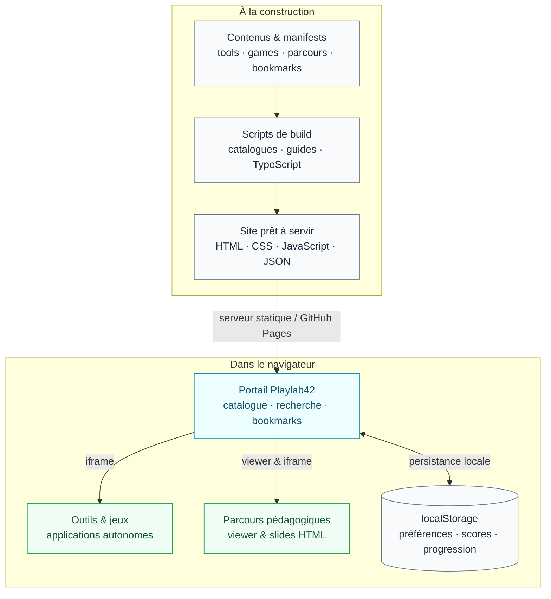

<div align="center">



# Playlab42

**Comprendre l’IA. Expérimenter en jouant. Construire ensemble.**

Un laboratoire pédagogique ouvert, où les parcours de formation<br/>
rencontrent les mini-jeux, les outils et le développement assisté par IA.

[**Explorer la plateforme →**](https://z4ppy.github.io/playlab42/) · [Contribuer](docs/guides/contributing.md) · [Documentation](#documentation)

[](https://github.com/z4ppy/playlab42/actions/workflows/ci.yml)
[](https://github.com/z4ppy/playlab42/actions/workflows/deploy.yml)
[](https://github.com/z4ppy/playlab42/actions/workflows/security-audit.yml)
[](https://codecov.io/gh/z4ppy/playlab42)
[](LICENSE)

</div>

## Un terrain de jeu, un vrai projet

**Playlab42 se découvre dans le navigateur et s’enrichit dans le dépôt.** Pas de compte à créer, pas de backend à déployer : la plateforme est entièrement statique.

Pendant une formation, on explore un concept, on l’expérimente, puis on crée quelque chose avec l’aide d’un agent IA. Un outil, un jeu, un parcours ou une amélioration de la documentation : chaque contribution peut devenir une ressource pour les sessions suivantes.

Le code fait lui aussi partie du cours. Moteurs de jeux déterministes, tests automatisés, spécifications OpenSpec, instructions pour agents et CI/CD rendent les pratiques de développement visibles, pas seulement théoriques.

## Explorer

| Univers | Ce qu’on y trouve | Quelques portes d’entrée |
|---------|-------------------|--------------------------|
| **Parcours** | Des contenus structurés en slides pour apprendre à son rythme. | [Agents de code](parcours/epics/coding-agents-2025/), [Deep learning](parcours/epics/deep-learning-intro/), [OpenSpec](parcours/epics/openspec-usage-guide/) |
| **Outils & simulations** | Des utilitaires et des expériences interactives pour manipuler les concepts. | [JSON Formatter](https://z4ppy.github.io/playlab42/tools/json-formatter.html), [Particle Life](https://z4ppy.github.io/playlab42/tools/particle-life/), [Relativity Lab 3D](https://z4ppy.github.io/playlab42/tools/relativity-lab/) |
| **Jeux** | Des jeux autonomes, avec des moteurs de règles et des bots pour expérimenter la logique et la stratégie. | [Morpion](https://z4ppy.github.io/playlab42/games/tictactoe/), [Mastermind](https://z4ppy.github.io/playlab42/games/mastermind/), [Go 9×9](https://z4ppy.github.io/playlab42/games/go-9x9/) |
| **Bookmarks** | Une sélection de ressources externes sur l’écosystème IA et le développement. | [Modèles & API](bookmarks/models-apis.json), [MCP](bookmarks/mcp-protocols.json), [Prompt engineering](bookmarks/prompt-engineering.json) |

**Première visite ?** Ouvrez [la plateforme](https://z4ppy.github.io/playlab42/) et commencez par le parcours **« PlayLab42 — Guide et usine logicielle »**.

## Architecture

**Un site statique, des contenus autonomes, un socle partagé.**



Les scripts préparent les catalogues, les guides et les dépendances destinées au navigateur, et transpilent les contenus TypeScript **avant** la mise en ligne. À l’usage, le navigateur charge les fichiers statiques ; aucune API applicative, base de données serveur ou authentification n’est nécessaire.

Les outils et les jeux peuvent aussi être ouverts en dehors du portail. Les bibliothèques de `lib/` apportent les briques communes : thèmes, générateur aléatoire déterministe, viewer de parcours et **GameKit**, le SDK de communication entre les jeux et le portail. Les préférences, scores et progressions restent stockés localement dans le navigateur, sans synchronisation entre appareils.

### Stack

| Couche | Technologies |
|--------|--------------|
| Interface | HTML, CSS, JavaScript en modules ES ; TypeScript optionnel |
| Construction | Node.js 26 dans Docker et la CI (minimum 24), esbuild, scripts de génération |
| Qualité | Jest, Playwright, ESLint, vérification des types TypeScript |
| Environnement | Docker, Docker Compose, Make |
| Livraison | GitHub Actions → GitHub Pages |
| Travail assisté par IA | [Instructions pour agents](AGENTS.md), [skills de projet](docs/guides/project-skills.md), [spécifications OpenSpec](openspec/specs/) |

## Démarrage rapide

Pour consulter le projet, [la version en ligne](https://z4ppy.github.io/playlab42/) suffit. Pour développer, l’environnement est **Docker-first** : les dépendances et les commandes Node.js tournent dans le conteneur.

**Prérequis :** Git, Docker avec Docker Compose et Make.

```bash
git clone https://github.com/z4ppy/playlab42.git
cd playlab42

# Construire l’environnement, démarrer le conteneur et installer les dépendances
make init

# Préparer les contenus, catalogues et guides sans enrichissement réseau
make npm CMD="run build:local"

# Afficher l’URL locale, puis lancer le serveur
make info
make serve
```

Ouvrez l’URL affichée par `make info`. Le port externe est calculé à partir du nom du dossier, dans la plage **5200–5299** ; `5242` est le port interne du conteneur.

### Au quotidien

| Commande | Usage |
|----------|-------|
| `make shell` | Ouvrir un shell dans le conteneur |
| `make npm CMD="run build:local"` | Reconstruire les contenus et catalogues sans enrichissement réseau |
| `make npm CMD="run build"` | Reconstruire avec enrichissement des métadonnées des bookmarks |
| `make build-ts` | Transpiler les contenus TypeScript |
| `make npm CMD="run build:ts:watch"` | Transpiler TypeScript en continu pendant le développement |
| `make test` | Exécuter les tests Jest |
| `make test-e2e` | Exécuter les parcours navigateur dans une image Docker dédiée |
| `make lint` | Vérifier la qualité du code |
| `make typecheck` | Vérifier les types |
| `make openspec-validate` | Valider strictement les spécifications avec la CLI épinglée |
| `make down` | Arrêter les conteneurs |

<details>
<summary><strong>Travailler sur plusieurs branches en parallèle</strong></summary>

Chaque worktree utilise un nom de projet Docker et un port calculés à partir de son dossier. Initialisez l’environnement dans chaque worktree avec `make init`, puis consultez son URL avec `make info`.

La plage de ports étant limitée, une collision reste possible. Pour choisir explicitement le port d’une instance, utilisez le même réglage pour ses commandes :

```bash
export PLAYLAB_PORT=5280
make init
make info
make serve
```

</details>

## Contribuer

**Une petite contribution peut devenir un excellent support de formation.** Vous pouvez créer un outil, ajouter un jeu ou un bot, écrire un parcours, proposer une ressource ou améliorer l’existant.

1. Créez un fork si nécessaire, puis une branche dédiée.
2. Ajoutez votre contenu et son manifest en suivant le guide correspondant.
3. Régénérez les catalogues, essayez le résultat dans le navigateur et lancez les contrôles adaptés : tests, lint et types.
4. Ouvrez une Pull Request : la contribution est relue avant intégration et publication.

| Vous souhaitez… | Commencer ici |
|-----------------|---------------|
| Créer un outil | [Guide de création d’un outil](docs/guides/create-tool.md) |
| Développer un jeu | [Moteur de règles](docs/guides/create-game-engine.md), [interface](docs/guides/create-game-client.md) et [bots](docs/guides/create-bot.md) |
| Écrire un parcours | [Guide de création d’un epic](docs/guides/create-epic.md) |
| Proposer une ressource | [Guide de contribution](docs/guides/contributing.md) |
| Partir d’un gabarit | [Kit de contribution et galerie des composants](docs/guides/contribution-kit.md) |
| Travailler avec un agent IA | [Instructions du projet](AGENTS.md) |

### Se repérer dans le dépôt

```text
playlab42/
├── index.html, app.js, style.css  # Entrée du portail
├── app/                          # Modules du portail
├── tools/                        # Outils HTML et mini-apps JS/TS
├── games/                        # Interfaces, moteurs de règles et bots
├── parcours/epics/               # Parcours, manifests et slides
├── bookmarks/                    # Ressources externes classées par thème
├── lib/                          # GameKit, thèmes, viewer et utilitaires
├── scripts/                      # Génération des catalogues et build TS
├── data/                         # Catalogues générés, non versionnés
├── site/                         # Archive publique préparée, non versionnée
├── docs/                         # Guides et documentation
├── templates/                    # Gabarits de jeux, outils et parcours
├── e2e/                          # Parcours navigateur Playwright
├── openspec/                     # Spécifications et propositions de changement
├── .github/skills/               # Skills de projet versionnés
└── .github/workflows/            # CI, audits et déploiement
```

## Documentation

| Pour… | Référence |
|-------|-----------|
| Comprendre les notions du projet | [Concepts & glossaire](docs/CONCEPTS.md) |
| Comprendre la génération des données | [Build des catalogues](docs/CATALOGUE-BUILD.md) |
| Consulter les contrats techniques | [Spécifications OpenSpec](openspec/specs/) |
| Appliquer le workflow de spécification | [Workflow OpenSpec](docs/guides/openspec-workflow.md) |
| Utiliser les skills du projet | [Skills de projet](docs/guides/project-skills.md) |
| Comprendre la stratégie de tests | [Stratégie de tests](docs/TESTING_STRATEGY.md) |
| Comprendre l'usine et ses limites | [Usine logicielle et feuille de route](docs/guides/software-factory.md) |
| Déployer la plateforme | [Guide de déploiement](docs/DEPLOYMENT.md) |
| Résoudre un problème local | [Dépannage](docs/TROUBLESHOOTING.md) |
| Consulter l’évolution du projet | [Changelog](CHANGELOG.md) |

## Licence

Playlab42 est un projet collaboratif porté par **Docaposte**, distribué sous licence [**CC BY-NC-SA 4.0**](LICENSE) : attribution, usage non commercial et partage des adaptations sous la même licence.

---

*Pourquoi « 42 » ? Un clin d’œil à Douglas Adams et à la grande question sur la vie, l’univers et le reste. Ici, on commence par expérimenter.*
