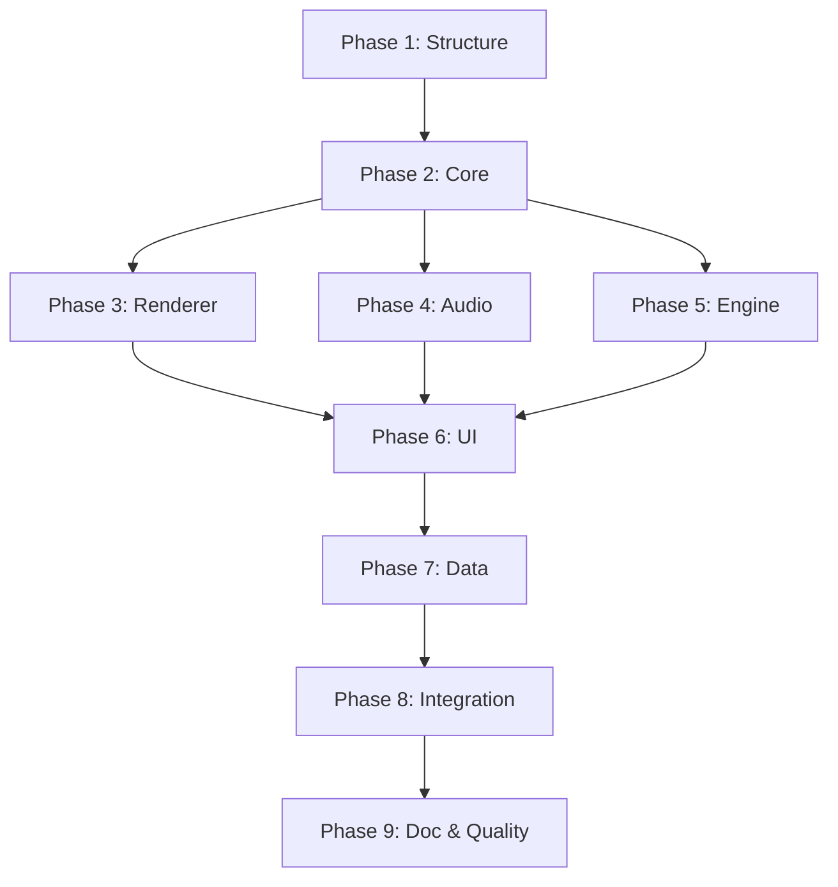

# Tasks: add-diese-et-mat

Checklist d'implémentation pour le jeu d'apprentissage musical "Diese & Mat".

## Phase 1: Structure et fondations

### 1.1 Création de la structure

- [x] Créer le dossier `games/diese-et-mat/`
- [x] Créer `game.json` (manifest)
- [x] Créer `index.html` (point d'entrée avec importmap)
- [x] Créer `README.md` (documentation utilisateur)
- [x] Créer `src/main.js` (bootstrap)
- [x] Créer `src/App.js` (orchestrateur)

### 1.2 Configuration CDN

- [x] Ajouter VexFlow à l'importmap
- [x] Ajouter Tone.js à l'importmap
- [ ] Vérifier le chargement des libs en standalone
- [ ] Ajouter fallback si CDN indisponible

## Phase 2: Modèle musical (core/)

### 2.1 Pitch.js - Hauteur de note

- [x] Classe `Pitch` avec pitchClass, octave, accidental
- [x] Conversion `toMidi()` (numéro MIDI 0-127)
- [x] Conversion `toFrequency()` (Hz)
- [x] Conversion `toFrench()` (Do♯4)
- [x] Conversion `toEnglish()` (C#4)
- [x] Conversion `toVexFlow()` (c#/4)
- [x] Méthode `getStaffPosition(clef)` (position sur portée)
- [x] Méthode statique `fromMidi(number)`
- [x] Méthode statique `fromString(name)` (parse "Do4", "C#5")
- [x] Tests unitaires `Pitch.test.js`

### 2.2 Duration.js - Durée rythmique

- [x] Classe `Duration` avec base, dots, tuplet
- [x] Conversion `toTicks()` (unités absolues)
- [x] Conversion `toBeats(timeSignature)`
- [x] Conversion `toVexFlow()` ("q", "8", "w"...)
- [x] Méthodes statiques factory (quarter(), eighth(), etc.)
- [x] Tests unitaires `Duration.test.js`

### 2.3 Interval.js - Intervalles

- [x] Classe `Interval` avec quality, number
- [x] Méthode statique `between(pitch1, pitch2)`
- [x] Conversion `toSemitones()`
- [x] Conversion `toFrench()` ("tierce majeure")
- [x] Méthode `apply(pitch)` (transposition)
- [x] Support enharmoniques
- [x] Tests unitaires `Interval.test.js`

### 2.4 Chord.js - Accords

- [x] Classe `Chord` avec root, type, inversion
- [x] Types: major, minor, diminished, augmented
- [x] Types 7èmes: maj7, min7, dom7, dim7
- [x] Méthode `getPitches()` (notes de l'accord)
- [x] Méthode `toFrench()` ("Do majeur")
- [x] Tests unitaires `Chord.test.js`

### 2.5 Scale.js - Gammes

- [x] Classe `Scale` avec root, type
- [x] Types: major, minor (natural, harmonic, melodic)
- [x] Méthode `getPitches()` (notes de la gamme)
- [x] Méthode `getDegree(n)` (nième degré)
- [x] Tests unitaires `Scale.test.js`

### 2.6 Module index

- [x] Créer `core/index.js` avec exports

## Phase 3: Rendu musical (renderer/)

### 3.1 StaffRenderer.js - Portée simple (fallback SVG)

- [x] Rendu SVG des 5 lignes
- [x] Support clé de sol et clé de fa (symboles)
- [x] Rendu des lignes supplémentaires
- [x] Rendu d'une note (ellipse)
- [x] Rendu des altérations (♯, ♭, ♮)
- [x] Support thème clair/sombre
- [ ] Tests unitaires

### 3.2 ScoreRenderer.js - Wrapper VexFlow

- [x] Initialisation VexFlow dans un container
- [x] Rendu d'une mesure simple
- [x] Rendu de plusieurs notes
- [x] Highlight d'une note (couleur)
- [x] Support signature de mesure
- [ ] Support armure
- [x] Cleanup/dispose
- [ ] Tests unitaires (avec mock VexFlow)

### 3.3 NoteRenderer.js - Note seule

- [x] Composant spécialisé pour afficher une note isolée
- [x] Mode "flash card"
- [x] Animation feedback (correct/incorrect)

## Phase 4: Moteur audio (audio/)

### 4.1 AudioEngine.js - Wrapper Tone.js

- [x] Initialisation Tone.js (gestion contexte audio)
- [x] Bouton "Activer le son" (user gesture)
- [x] Synthétiseur piano (PolySynth)
- [x] Méthode `playNote(pitch, duration)`
- [x] Méthode `playChord(pitches, duration)`
- [x] Méthode `playSequence(notes, tempo)`
- [x] Gestion du volume
- [x] Mute/unmute (intégration GameKit)
- [x] Cleanup/dispose
- [ ] Tests unitaires (avec mock Tone)

### 4.2 Metronome.js

- [x] Classe `Metronome` avec tempo, timeSignature
- [x] Start/stop
- [x] Callback sur chaque beat
- [x] Son de tick (accent sur temps 1)
- [x] Intégration avec AudioEngine

### 4.3 Sampler.js (optionnel)

- [ ] Chargement d'échantillons audio
- [ ] Lecture avec pitch shifting
- [ ] Pour sons d'instruments réalistes

## Phase 5: Moteur d'exercices (engine/)

### 5.1 QuestionGenerator.js

- [x] Génération de notes aléatoires (avec contraintes)
- [x] Génération de rythmes
- [x] Génération d'intervalles
- [x] Génération d'accords
- [x] Éviter répétitions consécutives
- [x] Pondération par difficulté
- [ ] Tests unitaires

### 5.2 ScoreCalculator.js

- [x] Calcul des points de base
- [x] Bonus de streak (série correcte)
- [x] Malus pour indices utilisés
- [x] Bonus temps (optionnel)
- [x] XP par skill
- [ ] Tests unitaires

### 5.3 ProgressTracker.js

- [x] Chargement progression (GameKit.loadProgress)
- [x] Sauvegarde progression (GameKit.saveProgress)
- [x] Mise à jour niveau par skill
- [x] Calcul accuracy par skill
- [x] Historique des sessions
- [x] Achievements/badges
- [ ] Tests unitaires

### 5.4 ExerciseEngine.js

- [x] Chargement d'un exercice (depuis exercises.json)
- [x] Démarrage de session
- [x] Gestion question courante
- [x] Soumission de réponse
- [x] Évaluation (correct/incorrect)
- [x] Passage à la question suivante
- [x] Fin de session et résumé
- [x] Événements (session-start, answer-submitted, etc.)
- [ ] Tests unitaires

## Phase 6: Interface utilisateur (ui/)

### 6.1 MenuView.js

- [x] Liste des catégories d'exercices
- [x] Liste des exercices par catégorie
- [x] Affichage difficulté/progression
- [x] Navigation vers exercice

### 6.2 ExerciseView.js

- [x] Zone de portée (ScoreRenderer ou StaffRenderer)
- [x] Zone de contrôles (boutons réponse)
- [x] Zone de feedback
- [x] Zone de progression (barre, score)
- [x] Bouton pause/quitter

### 6.3 NoteButtons.js

- [x] 7 boutons Do-Si (ou 12 avec altérations)
- [x] Support clavier (1-7)
- [x] États: normal, hover, correct, incorrect
- [x] Animation au clic

### 6.4 PianoKeyboard.js (optionnel)

- [ ] Clavier piano virtuel (2 octaves)
- [ ] Support clic et clavier
- [ ] Highlight de la note jouée
- [ ] Mode MIDI input (futur)

### 6.5 FeedbackDisplay.js

- [ ] Animation correct (vert, checkmark)
- [ ] Animation incorrect (rouge, croix)
- [ ] Affichage de la bonne réponse
- [ ] Son de feedback

### 6.6 ProgressView.js

- [ ] Niveau global et XP
- [ ] Progression par skill
- [ ] Historique récent
- [ ] Achievements débloqués

### 6.7 SettingsPanel.js

- [ ] Volume
- [ ] Notation (Do/Ré/Mi vs C/D/E)
- [ ] Difficulté par défaut
- [ ] Reset progression

## Phase 7: Données (data/)

### 7.1 exercises.json

- [x] Définition des exercices de lecture de notes
- [x] Définition des exercices de rythme
- [x] Définition des exercices d'intervalles
- [x] Définition des exercices d'accords
- [x] Niveaux de difficulté
- [x] Configuration par exercice

### 7.2 levels.json

- [ ] Définition des niveaux (XP requis)
- [ ] Déblocage progressif des exercices
- [ ] Configuration des achievements

## Phase 8: Intégration et polish

### 8.1 App.js - Orchestrateur

- [x] Initialisation GameKit
- [x] Gestion des vues (navigation)
- [x] Lifecycle hooks (pause, resume, dispose)
- [x] Gestion erreurs globale

### 8.2 Styles CSS

- [x] Variables CSS cohérentes avec theme.css
- [x] Support thème clair/sombre
- [x] Responsive design (mobile)
- [x] Animations et transitions

### 8.3 Vignette

- [x] Créer `thumb.svg` (380x180)
- [x] Design avec clé de sol et notes

### 8.4 Tests d'intégration

- [ ] Le jeu s'ouvre en standalone
- [ ] Le jeu s'intègre au portail
- [ ] La progression est sauvegardée
- [ ] Le son fonctionne
- [ ] Le thème fonctionne

## Phase 9: Documentation et qualité

### 9.1 Documentation

- [ ] README.md complet
- [ ] JSDoc sur toutes les classes/méthodes
- [ ] Commentaires en français

### 9.2 Qualité

- [x] `make lint` passe
- [x] `make test` passe
- [x] `make build-catalogue` inclut le jeu

### 9.3 Spec OpenSpec

- [ ] Créer `openspec/specs/diese-et-mat/spec.md`
- [ ] Documenter le modèle musical
- [ ] Documenter le système d'exercices
- [ ] Documenter le format de progression

## Dépendances entre phases



## Notes d'implémentation

### Import CDN

```javascript
// Dans main.js - lazy loading des libs lourdes
const loadVexFlow = () => import('vexflow');
const loadTone = () => import('tone');

// Charger au premier besoin
let VF = null;
async function getVexFlow() {
  if (!VF) {
    const module = await loadVexFlow();
    VF = module.Vex.Flow;
  }
  return VF;
}
```

### Gestion du contexte audio

```javascript
// Le navigateur bloque l'audio sans user gesture
let audioReady = false;

document.addEventListener('click', async () => {
  if (!audioReady) {
    await Tone.start();
    audioReady = true;
  }
}, { once: true });
```

### Structure de données exercice

```javascript
// Exemple exercises.json
{
  "exercises": [
    {
      "id": "note-treble-natural",
      "category": "note-reading",
      "mode": "visual-to-name",
      "title": "Clé de sol - Notes naturelles",
      "description": "Identifier les notes naturelles en clé de sol",
      "difficulty": 1,
      "skills": ["treble-clef"],
      "config": {
        "clef": "treble",
        "range": { "low": "C4", "high": "G5" },
        "accidentals": false,
        "questionsCount": 20,
        "timing": "untimed"
      }
    }
  ]
}
```
